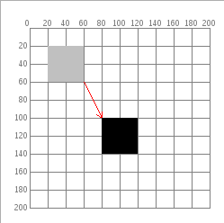
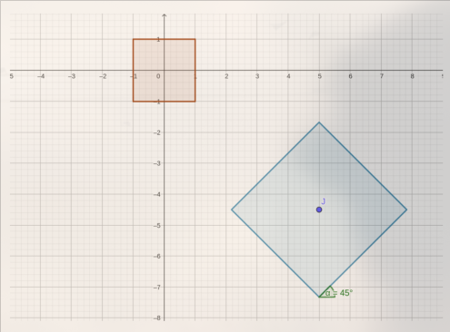
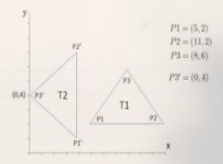
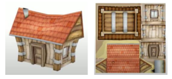
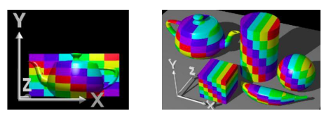
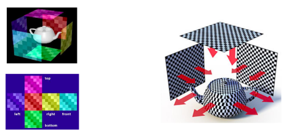
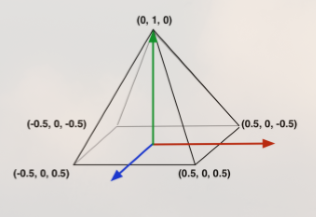

# Resolução

#### 1. Qual a diferença entre Processamento de Imagens, Visão Computacional e Síntese de Imagens?

No contexto da computação, as áreas citadas todas lidam com imagens, mas atuam
sobre estas com diferentes objetivos. À saber:

1. Síntese de imagens: representar objetos criados, utilizando-se de uma
   descrição destes (ex.: sua geometria, a interação deste com a luz) e recursos
   capazes de gerar imagens a partir de tal descrição.

2. Processamento de imagens: modificar características de imagens, usualmente
   com o propósito de relevar aspectos de interesse (ex.: ao reduzir ruído,
   ajustar brilho, eliminar distorções).

3. Visão Computacional: interpretar imagens, afim de que um computador seja
   capaz de agir sobre estas (ex.: detecção de objetos, reconhecimento de
   padrões).

#### 2. O que é e por qual motivo utilizar coordenada homogênea para especificar transformações geométricas em CG?

Coordenadas homogêneas － também denominadas "coordenadas projetivas" －estendem
as coordenadas euclidianas formando um sistema pelo qual transformações
geométricas tidas em um espaço tridimensional (como a perspectiva, entre outras)
podem ser representadas em uma superfície plana (espaço projetivo) a partir de
um conjunto de operações matemáticas sobre matrizes. Posto noutras palavras,
coordenadas homogêneas permitem a representação de imagens sobre um plano, ao
facilitar os cálculos envolvidos para tal.

#### 3. Apresente a matriz que representa uma transformação geométrica consistindo de uma translação seguida de uma rotação.

Seja:

- $(t_x, t_y, t_z)$ uma tupla representando uma translação em suas componentes
  euclidianas;

- $\theta_x$ uma rotação tida com relação ao eixo x, enquanto
  $c = \cos (\theta_x)$ e $s = \sin (\theta_x)$;

Um exemplo da transformação geométrica citada, representada em multiplicação de
matrizes, seria:

$$
\left [
\begin{matrix}
    1.0 & 0.0 & 0.0 & 0.0 \\
    0.0 & c & -s & 0.0 \\
    0.0 & s & c & 0.0 \\
    0.0 & 0.0 & 0.0 & 1.0 \\
\end{matrix}
\right ]
\times
\left [
\begin{matrix}
    1.0 & 0.0 & 0.0 & t_x \\
    0.0 & 1.0 & 0.0 & t_y \\
    0.0 & 0.0 & 1.0 & t_z \\
    0.0 & 0.0 & 0.0 & 1.0 \\
\end{matrix}
\right ]
=
\left [
\begin{matrix}
    1.0 & 0.0 & 0.0 & t_x \\
    0.0 & c & -s & ct_y - st_x \\
    0.0 & s & c & xt_x + st_y \\
    0.0 & 0.0 & 0.0 & 1.0 \\
\end{matrix}
\right ]
$$

#### 4. Discuta como é feito o posicionamento e orientação de cada objeto em uma cena.

Ao aplicarmos transformações geométricas como a translação, rotação
(exemplificadas anteriormente) e a escala, para obtenção de resultados os quais
não venham a distorcer a forma do objeto sendo representado (denominado
_skewing_) é importante nos atentarmos a ordem em que estas operações são
realizadas, tido que operações sobre matrizes **não são comutativas**.

Por exemplo, rotacionar e Transladar um objeto, nesta ordem, não produz o mesmo
resultado que seu contrário. Isto pois a rotação é então aplicada com relação a
uma posição a qual não é mais ocupada pelo objeto. Assim sendo, recomenda-se
utilizar da ordem de transformações SRT (_Scale, Rotation, Translation_) para
obtenção de resultados consistentes.

#### 5. Apresente a matriz que representa uma transformação consistindo de uma translação $t_x=M$ e $t_y=D$ seguida de uma escala uniforme $s = 2$. Qual o impacto dessa transformação para objetos definidos em relação à origem e para objetos fora da origem?

$$
\left [
\begin{matrix}
    2.0 & 0.0 & 0.0 & 0.0 \\
    0.0 & 2.0 & 0.0 & 0.0 \\
    0.0 & 0.0 & 2.0 & 0.0 \\
    0.0 & 0.0 & 0.0 & 1.0 \\
\end{matrix}
\right ]
\times
\left [
\begin{matrix}
    1.0 & 0.0 & 0.0 & M \\
    0.0 & 1.0 & 0.0 & D \\
    0.0 & 0.0 & 1.0 & t_z \\
    0.0 & 0.0 & 0.0 & 1.0 \\
\end{matrix}
\right ]
=
\left [
\begin{matrix}
    2.0 & 0.0 & 0.0 & 2M \\
    0.0 & 2.0 & 0.0 & 2D \\
    0.0 & 0.0 & 2.0 & 2t_z \\
    0.0 & 0.0 & 0.0 & 1.0 \\
\end{matrix}
\right ]
$$

Em ambos os casos, as transformações resultantes gerariam distorção no objeto,
pelas razões descritas no exercício anterior. Não obstante, por possuírem
localizações distintas com relação a origem, tais distorções não serão iguais.

#### 6. Verifique se R(M+D) irá obter a mesma matriz de transformação do que R(M)\*R(D), onde R é a transformação de rotação.

Não irá, é propriedade da multiplicação de matrizes que $A (B + C) = AB + AC$.

#### 7. Forneça a matriz de transformação que realiza a transformação abaixo (a seta indica o objeto inicial e o final após a transformação). Em seguida, apresente as coordenadas do objeto para uma escala uniforme s=M.

Seja:

- O eixo vertical denominado $y$ e o horizontal denominado $x$

- a translação $t$ dada nestes eixos por:

  - $t_y = 100 - 20 = 80$
  - $t_x = 80 - 20 = 60$
  - $t_z = 0$

- e uma escala uniforme $s = M$

Temos como matriz resultante:

$$
\left [
\begin{matrix}
    M & 0.0 & 0.0 & 60 \\
    0.0 & M & 0.0 & 80 \\
    0.0 & 0.0 & M & 0 \\
    0.0 & 0.0 & 0.0 & 1.0
\end{matrix}
\right ]
$$

#### 8. Considere a seguinte transformação linear, partindo do quadrado na origem.

##### a) Expresse a transformação como o produto de três matrizes. Considere que o quadrado azul possui lados de comprimento 4.

$$
% Translation
\left [
\begin{matrix}
    1.0 & 0.0 & 0.0 & 5.0 \\
    0.0 & 1.0 & 0.0 & -4.5 \\
    0.0 & 0.0 & 1.0 & 0.0 \\
    0.0 & 0.0 & 0.0 & 1.0 \\
\end{matrix}
\right ]
\times
% Rotation
\left [
\begin{matrix}
    1.0 & 0.0 & 0.0 & 0.0 \\
    0.0 & \frac{1}{\sqrt 2} & - \frac{1}{\sqrt 2} & 0.0 \\
    0.0 &  \frac{1}{\sqrt 2} & \frac{1}{\sqrt 2} & 0.0 \\
    0.0 & 0.0 & 0.0 & 1.0 \\
\end{matrix}
\right ]
% Scale
\times
\left [
\begin{matrix}
    2.0 & 0.0 & 0.0 & 0.0 \\
    0.0 & 2.0 & 0.0 & 0.0 \\
    0.0 & 0.0 & 2.0 & 0.0 \\
    0.0 & 0.0 & 0.0 & 1.0 \\
\end{matrix}
\right ]
$$

##### b) O que precisa ser feito para obter uma matriz de transformação do quadrado azul para o vermelho?

Uma nova multiplicação de matrizes, da seguinte forma:

$$
% Translation
\left [
\begin{matrix}
    1.0 & 0.0 & 0.0 & -5.0 \\
    0.0 & 1.0 & 0.0 & 4.5 \\
    0.0 & 0.0 & 1.0 & 0.0 \\
    0.0 & 0.0 & 0.0 & 1.0 \\
\end{matrix}
\right ]
\times
% Rotation
\left [
\begin{matrix}
    1.0 & 0.0 & 0.0 & 0.0 \\
    0.0 & \frac{1}{\sqrt 2} & - \frac{1}{\sqrt 2} & 0.0 \\
    0.0 &  \frac{1}{\sqrt 2} & \frac{1}{\sqrt 2} & 0.0 \\
    0.0 & 0.0 & 0.0 & 1.0 \\
\end{matrix}
\right ]
% Scale
\times
\left [
\begin{matrix}
    0.5 & 0.0 & 0.0 & 0.0 \\
    0.0 & 0.5 & 0.0 & 0.0 \\
    0.0 & 0.0 & 0.5 & 0.0 \\
    0.0 & 0.0 & 0.0 & 1.0 \\
\end{matrix}
\right ]
$$

#### 9. Forneça a sequência de transformações que leva o triângulo T1 ao triângulo T2 e dê a matriz resultante. É suficiente mostrar as matrizes que compõem a matriz resultante explicando o que é cada matriz e seus componentes.

A partir da análise do gráfico, tem-se que os triângulos possuem mesmo tamanho,
então o que leva T1 à T2 seria uma roação de -90º seguida de translação à
esquerda. Após ter-se calculado a localização dos centroides dos triângulos,
afere-se que ocorreu um deslocalmento
$(t_x, t_y) = \left( -\frac{16}3, + \frac
2 3\right)$. Para obter-se essa
transformação utilizando-se de coordenadas homogêneas, realiza-se a seguinte
multiplicação de matrizes:

$$
\underbrace{
\left [
\begin{matrix}
    1.0 & 0.0 & 0.0 & -\frac{16}3 \\
    0.0 & 1.0 & 0.0 & \frac 2 3 \\
    0.0 & 0.0 & 1.0 & 0.0 \\
    0.0 & 0.0 & 0.0 & 1.0 \\
\end{matrix}
\right ]
}_{\text{Translação}}
\times
% Rotation
\underbrace{
\left [
\begin{matrix}
    1.0 & 0.0 & 0.0 & 0.0 \\
    0.0 & 0.0 & - 1.0 & 0.0 \\
    0.0 & 1.0 & 0.0 & 0.0 \\
    0.0 & 0.0 & 0.0 & 1.0 \\
\end{matrix}
\right ]
}_{\text{Rotação}}
$$

#### 10. Mostre que a ordem das transformações pode modificar a matriz de transformação resultante (problema da comutatividade). OBS: É suficiente fornecer um exemplo.

Previamente abordado no exercício 4

#### 11. As transformações de rotação e escala são comutativas entre si? Leve em conta tanto escalas uniformes quanto não uniformes.

Multiplicações de matrizes por si só não são comutativas, então estas operações
não são comutativas entre si por conseguinte. Não obstante, como uma matriz de
escala uniforme é uma matriz diagonal, a ordem em que a multiplicação ocorre,
neste caso específico, não altera o resultado.

#### 12. As transformações de translação e escala são comutativas entre si? E entre translação e rotação?

Em nenhum dos casos se verifica comutatividade. A translação deve sempre ser
realizada após tais operações.

#### 13. Dado um vértice/ponto posicionado em x=D e y=M, apresente as matrizes de transformação para (1) espelhar esse vértice em relação ao eixo X e (2) espelhar esse vértice em relação ao eixo Y.

1. A seguinte matriz mantêm as coordenadas com relação ao eixo x mas nega
   aquelas com relação ao eixo y, fazendo com que os vértices resultem
   espelhados com relação ao eixo x.

   $$
   \begin{bmatrix}
   1 & 0 & 0 \\
   0 & -1 & 0 \\
   0 & 0 & 1
   \end{bmatrix}
   $$

2. A seguinte matriz faz o oposto.

   $$
   \begin{bmatrix}
   -1 & 0 & 0 \\
   0 & 1 & 0 \\
   0 & 0 & 1
   \end{bmatrix}
   $$

##### 14. Diferencie as matrizes de rotação 3D de acordo com o eixo de rotação. Por que a rotação 3D é mais complexa que a 2D?

Seja:

- $\theta$ um dado ângulo de rotação

- $c = \cos \theta$ e $s = \sin \theta$

São as matrizes de rotação tridimensional:

- Com relação ao eixo $x$:

$$
    \begin{bmatrix}
        1.0 & 0.0 & 0.0 & 0.0 \\
        0.0 & c & -s & 0.0 \\
        0.0 & s & c & 0.0 \\
        0.0 & 0.0 & 0.0 & 1.0
    \end{bmatrix}
$$

- Com relação ao eixo $y$:

$$
    \begin{bmatrix}
        c & 0.0 & s & 0.0 \\
        0.0 & 1.0 & 0.0 & 0.0 \\
        -s & s & c & 0.0 \\
        0.0 & 0.0 & 0.0 & 1.0
    \end{bmatrix}
$$

- Com relação ao eixo $z$:

$$
    \begin{bmatrix}
        c & -s & 0.0 & 0.0 \\
        s & c & 0.0 & 0.0 \\
        0.0 & 0.0 & 1.0 & 0.0 \\
        0.0 & 0.0 & 0.0 & 1.0
    \end{bmatrix}
$$

Vẽ-se que a rotação tridimensional é mais complexa que a bidimensional em função
da multiplicidade de eixos: enquanto a última só pode ser feita com relação ao
eixo $z$ a primeira pode ser feita a também a outro par de eixos, descritos
aqui.

#### 15. Uma rotação 3D em torno do eixo A = x, y ou z mantém ou altera o valor da coordenada A dos vértices do objeto? Por que isso ocorre?

Não, uma rotação em dado eixo A altera a coordenada do vetor em todos os eixos,
_senão_ A.

#### 16. Explique, com suas palavras, o mapeamento 2D de uma imagem de textura para um objeto 3D. Descreva ao menos três tipos de mapeamento.

Mapeamento de textura é o procedimento pelo qual fragmentos de uma imagem
bidimensional possuem suas características (cor, saturação, brilho) transpostas
a outros fragmentos na superfície de um objeto tridimensional. Existem muitas
métodos pelos quais tal correspondência pode ser feita, dentre os quais podemos
elencar:

1. Desdobramento UV: análogo à "desembrulhar" a superfície de um objeto sobre u
   plano. Um desenho correspondente é então feito sobre esta superfície e
   recolocado no objeto.

2. Mapeamento planar: o mapeamento da textura é feito sobre o objeto
   tridimensional "diretamente", selecionando-se dois eixos sobre os quais o
   mapeamento é feito.

3. Mapeamento cúbico: análogo ao mapeamento planar, mas feito em todos os pares
   de eixos e em sentidos opostos. Pode produzir um resultado superior ao
   planar, concentrando distorções às fronteiras entre os planos.

#### 17. Explique a relação entre pixel e texel.

Pixels (_picture elements_) e texels (_texture elements_) são unidades discretas
utilizadas para descrever dois componentes fundamentais a computação gráfica:
imagens (pictures) e texturas (textures), respectivamente. Ambos são elementos
bidimensionais, mas o segundo está necessariamente associado a um objeto
tridimensional, dando a este uma superfície característica. A relação entre
estes se dá quando tal objeto, cuja superfície contém texels, é representado em
uma imagem, cuja superfície contém pixels. Nestes casos, ocorre um mapeamento
entre as superfícies, e a resolução entre pixeis e texels pode divergir em
função da perspectiva.

#### 18. Na parametrização de texturas, explique a diferença entre os parâmetros REPEAT e CLAMP.

Quando a resolução da textura é incompatível ao preenchimento da superfície de
um dado objeto, as opções `REPEAT` e `CLAMP` oferecem parâmetros para completar
o preenchimento. A saber:

- O método `REPEAT` repete a textura ao longo da superfície do objeto, com
  cópias desta sendo colocadas de forma adjacente.

- O método `CLAMP` preenche o restante da superfície com valores cromáticos
  presentes na borda da textura (`CLAMP_TO_EDGE`) ou com uma dada cor sólida
  qualquer (`CLAMP_TO_BORDER`).

#### 19. Durante o mapeamento de pixels e texels, qual a diferença entre as técnicas LINEAR e NEAREST?

- Entre pixels e texels, dificilmente estes são encontrados em uma relação de
  escala de um para um (1:1), é mais frequente ocorrer a aplicação de um filtro
  de magnificação ou minificação do texel para que em correspondência discreta
  seja dada entre estes dois elementos. Nestes casos, a amostragem do texel pode
  ser de acordo com os parâmetros `NEAREST` ou `LINEAR`. À saber:

  - `NEAREST`: O pixel assume o valor de cor do texel cujo centro está mais
    próximo da coordenada de textura calculada para o centro do pixel.

  - `LINEAR`: O pixel assume o valor interpolado (ou média ponderada) entre os
    quatro texels que circundam a coordenada de textura calculada para o centro
    do pixel.

#### 20. As matrizes Model, View e Projection utilizam transformações geométricas 3D para compor as coordenadas de mundo, visão e clip. Esse processo também é chamado de pipeline do Viewing 3D. Escreva, com suas palavras, a função de cada etapa do pipeline.

Podemos descrever como sendo os propósitos das transformações, respectivamente:

- **Model:** Situar objetos em um sistema de coordenadas global, denominado
  "mundo", a partir dos vários sistemas de coordenadas locais em que cada objeto
  foi modelado (denominados minimundos). Isto é alcançado ao transformar cada
  objeto individualmente com relação ao sistema de coordenadas do mundo

- **View:** Orientar uma câmera, ou ponto de vista do observador, com relação ao
  sistema de coordenadas global. Isto é feito rotacionando e transladando a
  todos os vértices contidos no _mundo_.

- **Projection:** Projetar os objetos na visão da câmera, a _cena_, em um plano
  2D correspondente a superfície da tela. Isto pode ser feito de diferentes
  maneiras, as quais levam a projeção em perspectiva ou ortográfica.

#### 21. Apresente a matriz Model para transladar a pirâmide abaixo em -M no eixo z, ou seja, para posicionar a pirâmide mais ao “fundo” no espaço de mundo. Uma vez posicionada, quais são suas novas coordenadas (isto é, suas coordenadas no espaço de mundo)?

#### 22. Quais são os três parâmetros necessários para definir uma câmera?

Necessita-se indicar um par de pontos e um vetor para se situar uma câmera:

- Sua posição $pos = (p_x, p_y, p_z)$ com relação a origem do sistema de
  coordenadas do _mundo_

- Seu ponto focal, $fp = (l_x, l_y, l_x)$ utilizando-se do mesmo referencial

- Um vetor $\vec{up} = (up_x, up_y, up_z)$ indicativo da orientação vertical da
  câmera.

#### 23. Explique como calcular os vetores ortonormais do sistema de coordenadas da câmera utilizando os parâmetros mencionados no exercício anterior.

Sejam os vetores ortonormais, representativos da base ortonormal do sistema,
dados como $\vec X_c, \vec Y_c \vec Z_c$, temos:

- $\vec Z_c = \dfrac{\vec{LP}}{|\vec{LP}|}$, em que $\vec{LP} = pos - fp$

- $\vec X_c = \dfrac{\vec{up} \times \vec Z_c}{|\vec{up} \times \vec Z_c|}$

- $\vec Y_c = \vec Z_c \times \vec X_c$

#### 24. Apresente uma matriz View, com parâmetros definidos por você, para a pirâmide do exercício 21. Dê as coordenadas da pirâmide no espaço de visão.

#### 25. Considere um objeto 3D dado pelo vértices P1 = (-1, -1, +1); P2 = (+1, -1, -1); P3 = (-1, +1, -1 ) no sistema de coordenadas do mundo. Dados os parâmetros de câmera abaixo, dê as coordenadas dos vértices no sistema de coordenadas da câmera.

Posição Pos = (4, 2, 0) Ponto focal Pref = (0, 0, 0) Vetor up = (0, -1, 0)

#### 26. Pesquise e descreva brevemente o que são as transformações de câmera pitch, yaw e roll .

Por _pitch_, _yaw_, e _roll_ refere-se aos três graus de liberdade que um dado
corpo possui para rotacionar no espaço tridimensional, com relação a sua atual
orientação. Ou seja:

- _pitch_: rotação com relação ao eixo horizontal, faz a câmera apontar para
  cima ou para baixo;

- _yaw_: rotação com relação ao eixo vertical, faz a câmera virar para a
  esquerda ou para a direita;

- _roll_: rotação com relação ao eixo de profundidade, faz a câmera inclinar-se
  para a esquerda ou para a direita;

#### 27. Apresente uma matriz Projection, com parâmetros definidos por você, para a pirâmide do exercício 21. Dê as coordenadas da pirâmide no espaço clip.

#### 28. Qual o objetivo dos parâmetros Near e Far na matriz de projeção?

Estes estabelecem, respectivamente, os pontos minimo e máximo ao longo do eixo
de profundidade dentre os quais objetos encontram-se dentro do alcance do volume
de visão (frustrum). Isso é significativo, pois desta forma evita-se comprometer
a cena ou o desempenho geral da renderização desenhando-se objetos próximos ou
distantes de mais para serem propriamente apreendidos pelo observador.

#### 29. Dê três exemplos de uso das projeções paralela ortogonal e perspectiva.

- São usos para projeção ortogonal:

  - Preservar proporções de tamanho entre objetos, independentemente do
    posicionamento destes.

  - Em orientações laterais, frontais ou de cima ara baixo, favorecer a
    realização de medições.

- São usos para projeção em perspectiva:

  - Oferecer uma representação realística de profundidade, a despeito de alterar
    proporções entre objetos para tal.

#### 30. O que é um frustum na projeção perspectiva? Comente as três etapas para transformá-lo em um NDC (espaço normalizado).

Um objeto geométrico tridimensional, semelhante a uma pirâmide orientada
horizontalmente e com seu topo cortado, que abarca o volume de espaço que é
visível para a câmera. Noutras palavras, uma forma geométrica análoga a um "cone
de visão" para a câmera.

#### 31. Qual a relação do Frustum com o que será exibido na cena 3D?

Como se explica no exercício seguinte, o Frustrum estabelece os limites dentro
dos quais objetos contidos pelo mundo serão exibidos.

#### 32. Diferencie clipping de culling.

Quando vertices de um dado objeto encontram-se além do campo de visão (possuem
coordenadas as quais não estão contidas entre os valores $[-w, w]$) este objeto
está sujeito a _culling_ ou _clipping_.

- Por _culling_ denomina-se o descarte de superfícies no processo de
  renderização, seja por estas encontrarem-se inteiramente fora do campo de
  visão, seja por possuir orientação contrária à câmera (os versos dos objetos).

- O _clipping_, por outro lado, indica quando uma superfície encontra-se apenas
  parcialmente no campo de visão. Nestes casos os vértices obstruídos são
  descartados e ocorre a formação de novos triângulos nos pontos em que a
  geometria dos objetos se encontram com a superfície do frustrum.
