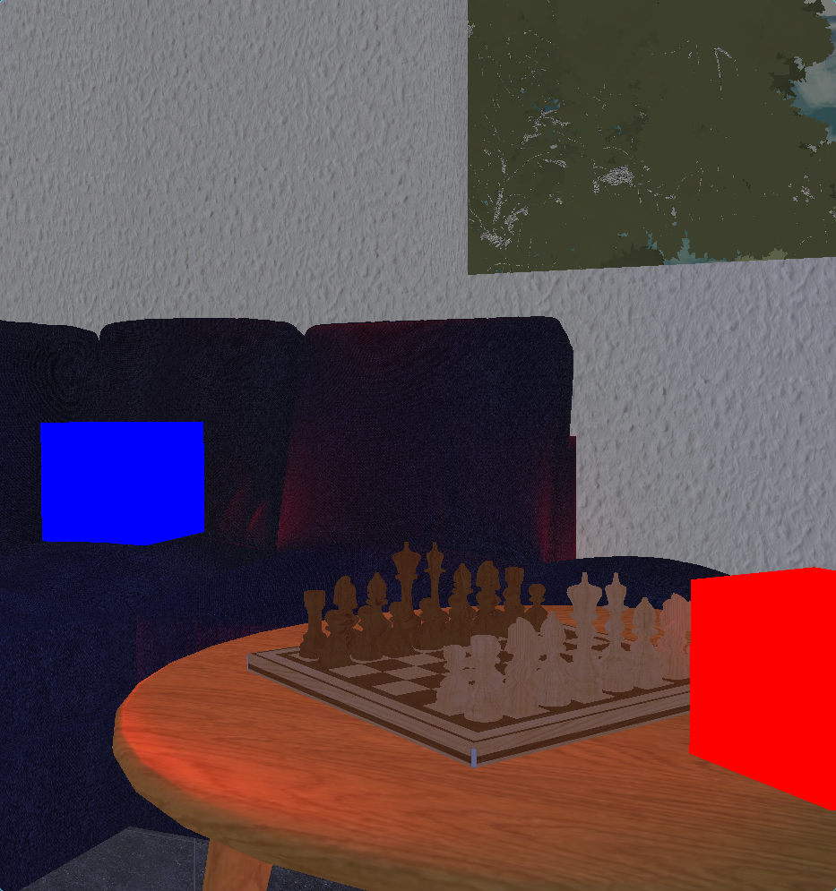

# Projeto 3



Demonstração de um programa simples fazendo uso do OpenGL para a renderização de
cenários 3D, com texturas e iluminação, à partir da importação de modelos em
arquivos `.obj`

> Autor: Guilherme de Abreu Barreto, nUSP: 12543033

## ▶️ Como Executar

### Usando Nix Flakes

Este projeto faz uso de [Nix Flakes](https://nixos.wiki/wiki/flakes) para a
instalação de dependências em um ambiente, para execução e desenvolvimento,
isolado. Um usuário que possui o gerenciador de pacotes Nix com Flakes
habilitados pode executar o programa com o comando:

```bash
nix run
```

E acessar um ambiente de desenvolvimento com:

```bash
nix develop
```

Pacotes instalados desta forma estão sujeitos a
[garbage collection](https://nix.dev/manual/nix/2.28/package-management/garbage-collection.html),
de forma a não poluir o sistema do usuário se usados apenas ocasionalmente.

### Usando `pip`

As dependências do projeto podem ser instaladas utilizando o gerenciador de
pacotes [`pip`](https://pypi.org/project/pip/) com o seguinte commando:

```bash
pip install -r requirements.txt
```

Em seguida o programa poderá ser executado com:

```bash
python src/main.py
```

## Adicionando modelos

Crie uma pasta para conter sua pasta de modelos 3D em qualquer lugar do seu
sistema. Ao executar o programa, você pode passar seu caminho como argumento:

```bash
python src/main.py /caminho/para/sua/pasta/de/modelos
```

Se nenhum argumento for fornecido, o programa usará `src/objects` como padrão.

### Estrutura de Pastas

Sua pasta de modelos deve conter subpastas para cada objeto, com a seguinte
estrutura:

```
 sua_pasta_de_modelos
├──  Objeto1
│   ├── 󰆧 model.obj
│   └──  texture.jpg (ou .png)
├──  Objeto2
│   ├── 󰆧 model.obj
│   └──  texture.png
...
```

### Configurando Objetos com config.toml

Crie um arquivo `config.toml` em sua pasta de modelos para definir as
propriedades dos objetos. Aqui está um modelo de exemplo:

```toml
[NomeDoObjeto]
position = [0.0, 0.0, -20.0]  # coordenadas x, y, z
rotation = [0.0, 0.0, 0.0]  # rotação x, y, z em radianos
scale = 1.0                 # fator de escala uniforme
location = "both"       # "internal", "external" ou "both"

# Coeficientes de reflexão
ambient_intensity = 0.5 # 0.0-1.0
diffuse_intensity = 0.5 # 0.0-1.0
specular_intensity = 0.5 # 0.0-1.0
specular_expoent = 32.0

emission_intensity = 0.0    # 0.0 para objetos não luminosos
ambient_color = [1.0, 1.0, 1.0] # valores RGB (0.0-1.0)
emission_color = [1.0, 1.0, 1.0]  # valores RGB (0.0-1.0)
```

Edite os valores para cada objeto em sua cena. O programa carregará
automaticamente todos os objetos definidos neste arquivo. Sempre que algum valor
não for definido, os valores padrão descritos acima são assumidos.

## 🕹️ Controles Interativos

### ⌨️ Teclado

| Teclas                        | Câmera                      | Transladar                      | Rotacionar                  | Escalar                     | Luz                         |
| ----------------------------- | --------------------------- | ------------------------------- | --------------------------- | --------------------------- | --------------------------- |
| **<kbd>1-5</kbd>**            | Alternar modo               | Alternar modo                   | Alternar modo               | Alternar modo               | Alternar modo               |
| **<kbd>z</kbd>/<kbd>x</kbd>** | Alternar objetos (ant/próx) | Alternar objetos (ant/próx)     | Alternar objetos (ant/próx) | Alternar objetos (ant/próx) | Alternar objetos (ant/próx) |
| **<kbd>w</kbd>**              | Mover para frente           | Mover objeto para trás (z-)     | Rotacionar objeto X-        | Aumentar escala             | Alternar luz ambiente       |
| **<kbd>s</kbd>**              | Mover para trás             | Mover objeto para frente (z+)   | Rotacionar objeto X+        | Diminuir escala             | Alternar fonte de luz 2     |
| **<kbd>a</kbd>**              | Mover para esquerda         | Mover objeto para esquerda (x-) | Rotacionar objeto Y-        | -                           | Alternar fonte de luz 1     |
| **<kbd>d</kbd>**              | Mover para direita          | Mover objeto para direita (x+)  | Rotacionar objeto Y+        | -                           | Alternar fonte de luz 3     |
| **<kbd>q</kbd>**              | Mover para cima             | Mover objeto para cima (y+)     | Rotacionar objeto Z+        | -                           | -                           |
| **<kbd>e</kbd>**              | Mover para baixo            | Mover objeto para baixo (y-)    | Rotacionar objeto Z-        | -                           | -                           |
| **<kbd>t</kbd>**              | Alternar modo wireframe     | Alternar modo wireframe         | Alternar modo wireframe     | Alternar modo wireframe     | Alternar modo wireframe     |
| **<kbd>r</kbd>**              | Resetar câmera              | Resetar objeto                  | Resetar objeto              | Resetar objeto              | Resetar objeto              |
| **<kbd>esc</kbd>**            | Fechar aplicação            | Fechar aplicação                | Fechar aplicação            | Fechar aplicação            | Fechar aplicação            |

### Seleção de Modo

Pressione estas teclas para alternar entre os modos de interação:

- **<kbd>1</kbd>**: Modo câmera (padrão)
- **<kbd>2</kbd>**: Modo translação
- **<kbd>3</kbd>**: Modo rotação
- **<kbd>4</kbd>**: Modo escala
- **<kbd>5</kbd>**: Modo controle de luz

> 💡 O modo atual é exibido na saída do console.

### 🖱️Mouse ou Touchpad

| Ação         | Efeito            |
| ------------ | ----------------- |
| **Arrastar** | Rotacionar câmera |
| **Scroll**   | Zoom in/out       |

> [!TIP]
>
> 1. O objeto selecionado aparece destacado no console
> 2. Modo wireframe (<kbd>p</kbd>) exibe apenas a estrutura poligonal
> 3. Reset (<kbd>b</kbd>) volta posição/rotação/escala para os valores iniciais
> 4. Movimentos da câmera são relativos à sua orientação atual

## Averiguação

O atual estado dos objetos pode ser acompanhado em uma tabela emitida ao
console, atualizada toda vez que ocorre uma mudança neste.


